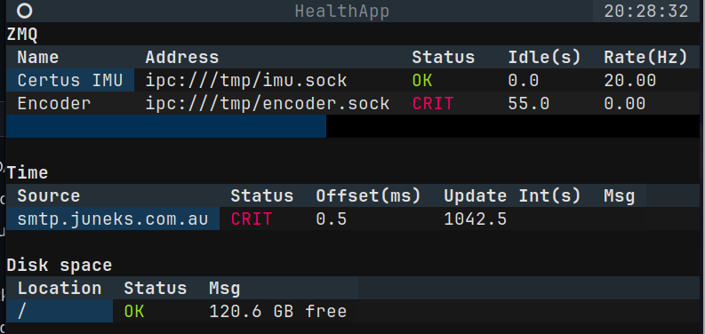

# UniSQ Imaging and Diagnostics Device (IDD) Software

Software to receive, process, broadcast, log, and monitor data from external (non camera) devices, including
- Time server sources
- Encoders
- IMUs
- Local disk storage

Emphasis is placed on:
- Reliability and robustness
- Simplicity and human oversight
- Low latency and event-driven (where possible)

## Install
Install should be completed by the bash script `install.sh`, but there are no guarentees of missing dependencies.
If you find missing dependencies or broken links, please update the install script and submit a PR.

## Features
- Installation and setup of environment, dependencies and permissions
- Receive data from devices, log, and broadcast to ZMQ PUB sockets
- Monitor the behavior of cameras via ZMQ health broadcast messages
- Monitor the status of devices, time offset, and disk space via a TUI dashboard
- Log data to CSV files

## Devices
- [Advanced Navigation Certus Mini D IMU](docs/certus.md)
- [Local network Time Server](docs/ntp.md)
- [Encoder board](docs/encoder.md)

# Networking
This repository makes use of ZMQ for inter-process communication, for various reasons (including allowing true multi-threading).
Device monitor scripts broadcast data as PUB sockets, and other users can extract this data as SUB sockets.
When this is only done on a single local machine the IPC protocol is reocmmended.
When mutliple machines are used, TCP is required.
The protocol and address can be specified in the YAML config files for each device.

## Device identification
The most reliable way to identify a USB serial device is by the vendor and product ID (VID:PID).
This an be queried by `$ lsusb` (although you will have to identify the device).
Alternatively, query `$ dmesg | grep -1 usb` after plugging it in to see recent USB activity.
The VID:PID is constant for device class, regardless of which individual device, PC, or port is used.
This is much more reliable than speciying port directly, which are assigned dynamically.
The VID:PID should be specified in the YAML file for each decice - defaults are included for known devices.
